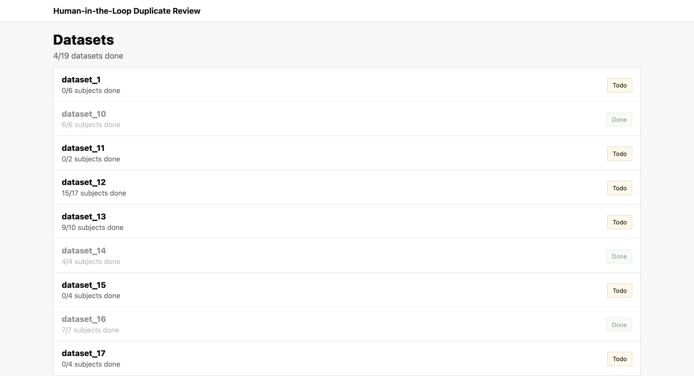
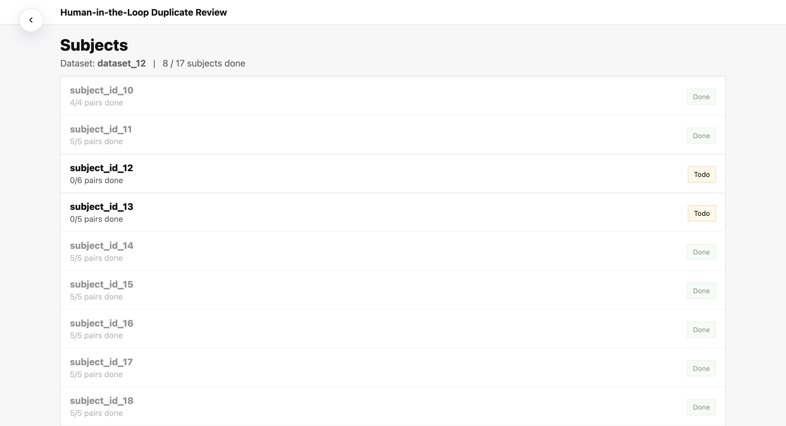
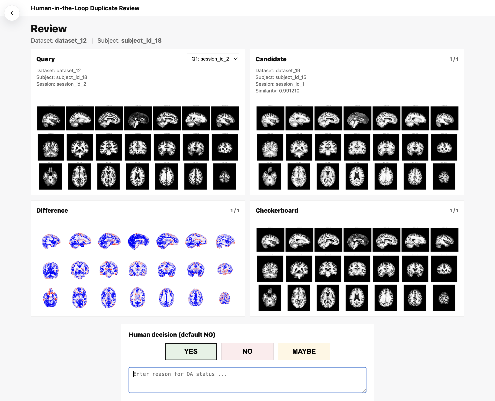

# HAPPEN: Human-in-the-Loop Auditing Pipeline for Exact and Near Duplicates in MRI Repositories

HAPPEN is a containerized system for auditing identity duplication in large T1-weighted brain MRI repositories. It consists of two major components:

- an auditing pipeline, which detects exact and near duplicates and generates reviewable outputs; and
- a review interface, which supports human review and decision of the generated near-duplicate candidates.

The auditing pipeline contains two stages:

- **Stage I (`exact`)**: detects exact duplicates via SHA-256 voxel-array fingerprints.
- **Stage II (`near`)**: detects identity-level near duplicates via a pretrained embedding model and FAISS similarity retrieval.

Rather than automatically merging or deleting files, HAPPEN generates reviewable reports and candidate lists for human review. These outputs can then be examined in the built-in review interface.

Instructions for using the review interface are provided in the **Review interface** section.

## Access the container image

HAPPEN is distributed as a docker image through GitHub Container Registry (GHCR).

Before pulling the image, make sure that you have created a **GitHub Personal Access Token (classic)** with at least the `read:packages` scope.

Then log in to GHCR and pull the image:

```bash
export CR_PAT="<GITHUB_CLASSIC_PAT>"

echo "$CR_PAT" | docker login ghcr.io -u <github_username> --password-stdin

docker pull <container_image>
```

If your system requires `sudo` for Docker, use:

```bash
echo "$CR_PAT" | sudo docker login ghcr.io -u <github_username> --password-stdin

sudo docker pull <container_image>
```

### Container images and package locations

- Recommended fixed version tag:
  `ghcr.io/jihengli/happen:v0.1.0-cu128`

- Convenience tag:
  `ghcr.io/jihengli/happen:latest`

- GitHub Package page:
  `https://github.com/users/JihengLi/packages/container/package/happen`

## Usage overview

HAPPEN is launched through `./run_happen.sh`. The script is designed to launch the container, set up the required bind mounts, and pass the selected mode and configuration file into the container.

Before running HAPPEN, clone this repository and run `./run_happen.sh` from the repository root. Do **not** try to run `run_happen.sh` inside the container.

General command pattern:

```bash
sudo HAPPEN_IMAGE=<container_image> ./run_happen.sh <mode> <config.toml> [--bind <host_path> ...]
```

Where:

- `<mode>` selects the execution mode:
  - `pipeline`: run the main auditing pipeline
  - `review`: launch the review interface for inspecting candidate pairs
- `<config.toml>` is the user configuration file
- `--bind <host_path>` mounts an additional host directory into the container and can be provided multiple times

## Quick start

1. Copy the user configuration template:

```bash
cp configs/config_usr.toml my_config.toml
```

2. Edit `my_config.toml` and fill in the required paths.

3. Run the full pipeline:

```bash
sudo HAPPEN_IMAGE=<container_image> ./run_happen.sh pipeline my_config.toml
```

If your input data or output locations require additional host mounts, add one or more `--bind` arguments:

```bash
sudo HAPPEN_IMAGE=<container_image> \
./run_happen.sh pipeline my_config.toml \
  --bind /path/to/host1 \
  --bind /path/to/host2
```

4. After the pipeline has finished, launch the review interface with:

```bash
sudo HAPPEN_IMAGE=<container_image> \
./run_happen.sh review my_config.toml
```

## Input and configuration

HAPPEN is configured through a user-provided TOML file, which is organized into four sections:

- `[run]`: global run settings
- `[exact]`: exact-duplicate auditing settings
- `[near]`: near-duplicate retrieval and review-asset generation settings
- `[review]`: review interface settings

A minimal example is shown below:

```
  [run]
  out = ""
  stages = ["exact", "near"]
  profile_runtime = true

  [exact]
  root = ""
  candidates_csv = ""
  valid_csv = ""
  thread_workers = 32
  process_workers = 16

  modality = "T1w"

  [near]
  preprocess_workers = 16
  device = "auto"
  min_similarity = 0.92
  review_mode = "lazy" # off | lazy | precompute
  review_workers = 16

  batch_size = 16
  use_amp = true
  overwrite_embeddings = false
  fail_fast = false
  topk = 500
  retrieval_batch_size = 2048
  use_ivf = true
  nlist = 4096
  nprobe = 64
  train_size = 200000
  seed = 0
  overwrite_retrieval = false
  overwrite_review_assets = false
  max_scan_candidates_per_query = 100

  [review]
  port = 8000

  autosave_every = 1
  host = "0.0.0.0"
  preview_max_width = 1200
  debug = false
```

### Important configuration guide

For most users, only a small number of parameters need to be edited.

#### 1. Output directory

- `[run].out`: output directory for all generated artifacts, reports, logs, and review files.

#### 2. Pipeline stages

- `[run].stages`: stages to execute. In most cases, use `["exact", "near"]`.

#### 3. Exact-stage input

The exact stage supports three input fields:

- `root`
- `candidates_csv`
- `valid_csv`

> **Important: only one of the three may be used.**

- `[exact].root`: root directory of a BIDS-style filesystem. When `root` is provided, HAPPEN automatically searches the repository and discovers all eligible T1-weighted scans.
- `[exact].candidates_csv`: path to a candidate CSV with the columns `dataset,subject_id,session_id,candidate`. Here, `candidate` is the input file path provided to the pipeline. HAPPEN performs an initial validation step and resolves each candidate to a usable `resolved_path`.
- `[exact].valid_csv`: path to a validated CSV with the columns `dataset,subject_id,session_id,candidate,resolved_path`. This option is intended for cases where validation and path resolution have already been completed in advance.

The exact stage also has two important runtime parameters:

- `[exact].thread_workers`: number of thread-based workers used by the exact stage.
- `[exact].process_workers`: number of process-based workers used by the exact stage.

These values affect throughput and may need adjustment depending on the available CPU resources on your system.

#### 4. Near-stage runtime settings

- `preprocess_workers`: number of workers used during preprocessing. In our reference runs, we used preprocess_workers = 32 on a system with 48 GB GPU memory.
- `device`: compute device to use.
- `min_similarity`: similarity threshold for retaining near-duplicate candidates. Default is 0.92.

#### 5. Review-asset preparation

- `review_mode`: controls how review PNGs are generated.
  - `"off"`: do not prepare review assets
  - `"lazy"`: generate PNGs only for near-duplicate scans; assets (difference and checkerboard images) are generated on demand from the frontend workflow
  - `"precompute"`: generate all review PNGs in advance on the backend before review begins

- `review_workers`: number of workers used for review-asset generation.

#### 6. Review server settings

- `port`: port used by the review server

### Other parameters

The remaining parameters are usually safe to leave at their default values unless you have a specific reason to change them.

#### `[run]`

- `profile_runtime`: if `true`, HAPPEN records runtime profiling information.

#### `[exact]`

- `modality`: MRI modality to process. Default is `"T1w"`.

#### `[near]`

- `batch_size`: number of embeddings buffered before each save during near-stage processing.
- `use_amp`: if `true`, use automatic mixed precision when supported.
- `fail_fast`: if `true`, stop immediately when an error occurs.
- `topk`: number of nearest neighbors retrieved per query using FAISS before thresholding.
- `retrieval_batch_size`: batch size used during FAISS retrieval.
- `use_ivf`: whether to use IVF-based approximate nearest-neighbor retrieval.
- `nlist`: number of IVF coarse clusters.
- `nprobe`: number of IVF clusters probed during search.
- `train_size`: number of samples used to train the IVF index.
- `seed`: random seed used for retrieval-related steps.
- `overwrite_embeddings`: if `true`, recompute embeddings even if cached outputs already exist.
- `overwrite_retrieval`: if `true`, recompute retrieval outputs even if cached outputs already exist.
- `overwrite_review_assets`: if `true`, regenerate review assets even if they already exist.
- `max_scan_candidates_per_query`: maximum number of retained scan-level candidates per query.

#### `[review]`

- `autosave_every`: save review decisions after this many updates.
- `host`: host address used by the review server.
- `preview_max_width`: downsamples preview images to reduce browser memory usage.
- `debug`: enables debug mode if set to `true`.

## Outputs

All outputs are written under `[run].out`. The two main output folders are:

- `exact/`
- `near/`

### `exact/`

- `candidates.csv`: candidate scans that searched from `[exact].root` or from input.
- `valid.csv`: all validated T1w MRI scans that passed input checking or from input.
- `invalid_missing_paths_discovery.csv`: scans removed because the input path could not be found.
- `invalid_not_nifti_discovery.csv`: scans removed because the file was not a NIfTI image.
- `invalid_permission_denied_paths_discovery.csv`: scans removed because the file could not be accessed due to permission errors.
- `invalid_unreadable_discovery.csv`: scans removed because the file could not be read.
- `invalid_derivatives.csv`: scans removed because they were recognized as derivatives rather than source scans.
- `T1w_hashes.csv`: SHA-256 voxel-array hashes for all validated scans.
- `hash_errors.csv`: scans that failed during hashing.
- `duplicates.csv`: the main exact-duplicate table; all scans involved in exact duplicates, grouped by duplicate group.

- `by_category/`: exact duplicates reorganized by duplicate type.
  - `within_sessions.csv`: duplicates within the same session.
  - `within_subjects.csv`: duplicates across sessions within the same recorded subject.
  - `within_datasets.csv`: duplicates across different recorded subjects within the same dataset.
  - `across_datasets.csv`: duplicates across different datasets.

- `by_category_stats/`: summary statistics for the four duplicate categories above.

- `by_dataset/`: exact-duplicate outputs reorganized by dataset.

- `figures/files_matrix_T1w.html`: recommended summary view; an interactive lower-triangular matrix showing exact duplicates between dataset pairs. Open in a browser.

### `near/`

- `no_exact_dup.csv`: near-stage input after removing exact duplicates.
- `exact_removed.csv`: scans removed from the near stage because they were already identified as exact duplicates.
- `embedding_manifest.csv`: manifest of scans used for embedding inference.
- `embeddings.npy`: computed embeddings for the scans in `embedding_manifest.csv`.
- `embedding_failures.csv`: scans that failed during preprocessing or embedding inference.
- `raw_neighbors.csv`: raw FAISS retrieval results; for each scan, the top retrieved similar scans before final filtering.
- `scan_candidates.csv`: the main near-duplicate output; final scan-level near-duplicate candidates after filtering.
- `subject_edges.csv`: subject-level links derived from scan-level candidates.
- `subject_groups.csv`: subject-level connected groups derived from the candidate graph.

- `by_category/`: near-duplicate candidates reorganized by category.
- `by_category_stats/`: summary statistics for the near-duplicate categories.
- `by_dataset/`: near-duplicate candidates reorganized by dataset.
- `figures/`: near-stage summary figures based on unreviewed candidates; useful for rough inspection only.

- `review/`: outputs used by the review tool.
  - `review_candidates.csv`: candidate pairs presented to the review interface.
  - `review_decisions.csv`: saved human review decisions.
  - `scan_asset_failures.csv`: scans whose review PNGs could not be generated.
  - `pair_asset_failures.csv`: scan pairs whose diff/checkerboard assets could not be generated.
  - `assets/png/`: PNG renderings of scans involved in review.
  - `assets/diff/`: difference images for near-duplicate scan pairs.
  - `assets/checkerboard/`: checkerboard comparison images for near-duplicate scan pairs.

### Most important outputs

- `exact/duplicates.csv`: Exact deduplication result.
- `exact/figures/files_matrix_T1w.html`: Clear visualization for the exact duplicates.
- `near/scan_candidates.csv`: Near deduplication result.
- `near/review/review_decisions.csv` (after review): Human-in-the-loop auditing result.

## Review interface

HAPPEN also provides a built-in review interface for human inspection of near-duplicate candidates.

The review interface is **scan-level**. For each query scan, the interface displays all candidate scans that satisfy the our filtering criteria. For each scan pair, HAPPEN reports the corresponding:

- dataset
- subject
- session
- similarity score

The reviewer then decides whether the pair is a true near duplicate.

The interface contains three views:

### 1. Dataset view (Entrypoint of the app)



### 2. Subject view



### 3. Review view



### Keyboard navigation

User can use keyboard navigation to change scans in `3. Review view`:

- Left / Right arrow keys: switch between candidate scans for the same query scan
- Up / Down arrow keys: switch between query scans or subjects within the same dataset

## Third-party licenses

Third-party licenses for redistributed resources and dependencies are provided in `resources/licenses/`.
